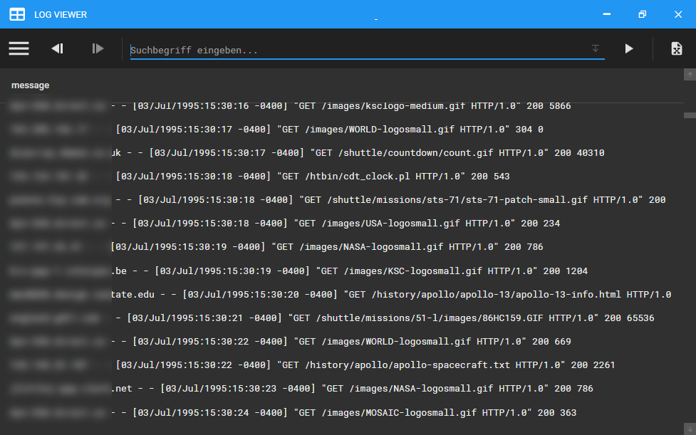
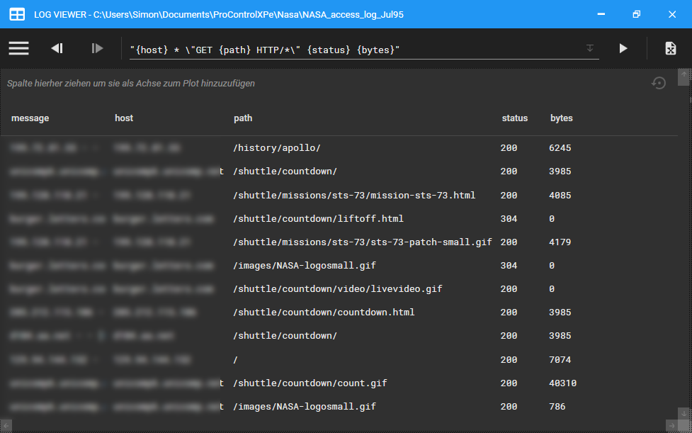
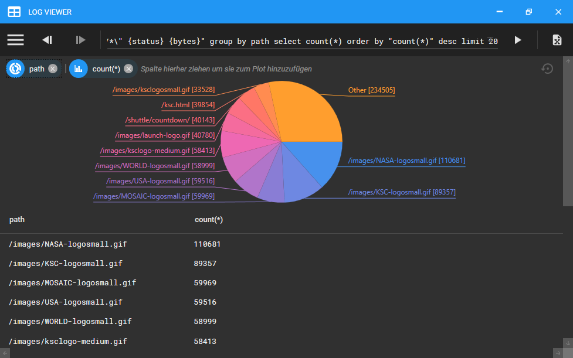
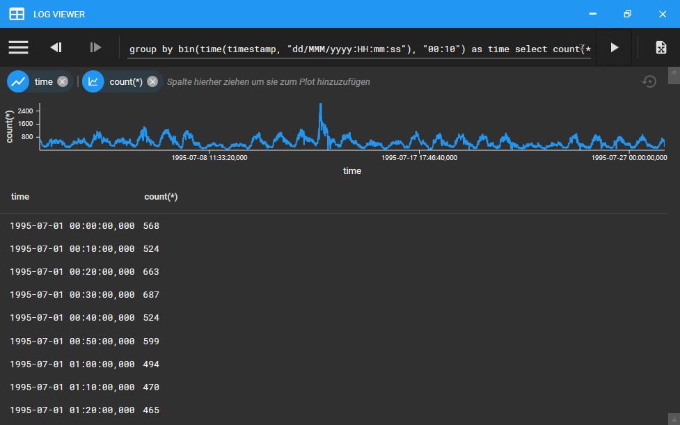

**LOG VIEWER** is a versatile application for viewing and analyzing log files produced by any other application. 
It is independent from any logging framework or format as it processes line based plain text.
These lines can be searched, filtered and parsed for distilling information out of them. 
A selection of charts is available to visualize the gained information for fast analysis. 
If more in depth analysis is required, it is possible to export the generated data 
as a comma separated values (CSV) file.

**This program is an active work-in-progress. As such it may (and will) contain bugs.**

*In case you find one of those, please open an issue and attach the application log (logviewer/log/log.txt) containing the problem*
*If you are missing a feature you can also open an issue or, even better, fork the repository and contribute to the project with a pull request...*

## Features

* No installation or infrastructure required
* Open multiple sequential log files at once
* Open archives with multiple sequential log files
* Display different views of the log in multiple tabs
* Automatic encoding & line ending detection
* Fast log file search and display
* Line parsing using patterns and dedicated parsers
* Filter and group lines using parsed values
* Visualize log file data using quick charting functions
* Export processed data for further analysis
* Save queries and searches for later use
* Export/Import saved queries and searches
* Extensible through a plugin API

The query language is inspired by SQL and LINQ. See [here](logviewer.query/HELP.md) for further information.

## Screenshots

Web server log file opened in **LOG VIEWER**:

Log file lines parsed into fields:

Top twenty request paths extracted from log file:

Requests over time in 10 minute intervals:

## Libraries and more

The following components were used in the creation of **LOG VIEWER** and were a tremendous help

* [ControlzEx](https://github.com/ControlzEx/ControlzEx)
* [MaterialDesignInXamlToolkit](https://github.com/MaterialDesignInXAML/MaterialDesignInXamlToolkit)
* [markdig.wpf](https://github.com/Kryptos-FR/markdig.wpf)
* [markdig](https://github.com/lunet-io/markdig)
* [Sprache](https://github.com/sprache/Sprache)

The sample data set in screenshots was obtained from http://ita.ee.lbl.gov/html/contrib/NASA-HTTP.html